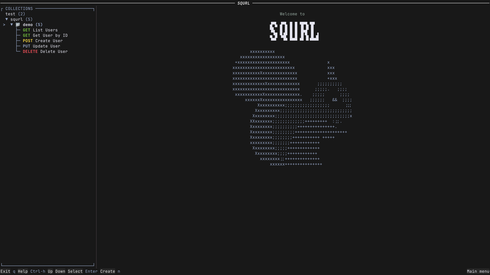
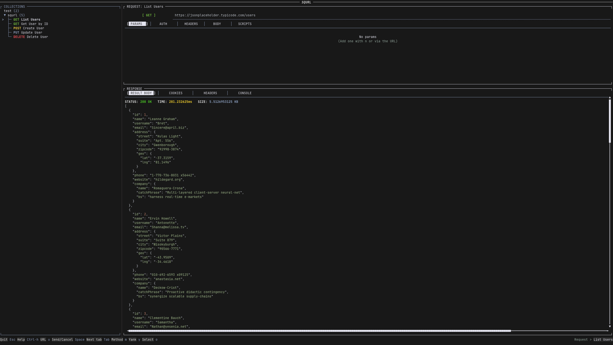

# squrl

[](https://github.com/FloodCreux/squrl/actions/workflows/ci.yml)
[](https://github.com/FloodCreux/squrl/actions/workflows/release.yml)
[](LICENSE)
[](https://www.rust-lang.org/)

A terminal-based HTTP and WebSocket client built with Rust. Think Postman or Insomnia, but in your terminal -- no GUI required.




## Table of Contents

- [Features](#features)
- [Installation](#installation)
- [Docker](#docker)
- [Usage](#usage)
  - [TUI (interactive)](#tui)
  - [CLI](#cli)
- [Configuration](#configuration)
- [Themes](#themes)
- [Key Bindings](#key-bindings)
- [Development](#development)
- [Acknowledgements](#acknowledgements)
- [License](#license)

## Features

- **Dual interface** -- interactive TUI and full-featured CLI
- **HTTP client** -- all 9 standard methods (GET, POST, PUT, PATCH, DELETE, OPTIONS, HEAD, TRACE, CONNECT) with configurable timeouts, redirects, and proxy support
- **WebSocket support** -- connect, send/receive messages, and track connection state
- **Collections** -- organize requests in JSON, YAML, or `.http` files with tree-based navigation, optional folder grouping, and round-trip write-back for `.http` collections
- **Environments** -- key-value variables with `{{variable}}` substitution across URLs, headers, bodies, auth, and scripts
- **Authentication** -- Basic, Bearer Token, JWT (HS/RS/ES/PS/EdDSA), and Digest (MD5, SHA-256, SHA-512)
- **Request bodies** -- raw text, JSON, XML, HTML, JavaScript, file upload, URL-encoded form, and multipart
- **Pre/post request scripts** -- JavaScript execution via embedded Boa runtime
- **Response handling** -- pretty-printed JSON, syntax highlighting, image preview, cookies, and headers
- **Import** -- Postman collections & environments, cURL commands, OpenAPI specs, and `.http` files (including `WEBSOCKET` requests)
- **Export** -- HTTP, cURL, PHP Guzzle, Node.js Axios, and Rust reqwest
- **Themes** -- 9 built-in themes (Gruber Darker, Dracula, Catppuccin variants, Gruvbox, and more) plus custom TOML themes
- **Key bindings** -- fully customizable with Vim, Emacs, and default modes
- **Clipboard** -- copy response bodies and exports (optional feature)
- **Shell completions & man pages** -- Bash, Zsh, and Fish via clap

## Installation

### Homebrew

```sh
brew tap FloodCreux/squrl
brew install squrl
```

### Scoop (Windows)

```powershell
scoop bucket add squrl https://github.com/FloodCreux/scoop-squrl
scoop install squrl
```

### Pre-built binary

**macOS / Linux:**

```sh
curl -fsSL https://raw.githubusercontent.com/FloodCreux/squrl/main/scripts/curl-install.sh | sh
```

**Windows (PowerShell):**

```powershell
irm https://raw.githubusercontent.com/FloodCreux/squrl/main/scripts/curl-install.ps1 | iex
```

### Build from source

**macOS / Linux:**

```sh
git clone https://github.com/FloodCreux/squrl.git
cd squrl
./scripts/install.sh
```

**Windows (PowerShell):**

```powershell
git clone https://github.com/FloodCreux/squrl.git
cd squrl
.\scripts\install.ps1
```

### Using just

```sh
just install
```

This builds a release binary and installs the binary, shell completions, and man page to `~/.local`.

## Docker

A multi-stage Dockerfile is included for building a minimal Docker image containing the statically linked `squrl` binary. It uses [cargo-chef](https://github.com/LukeMathWalker/cargo-chef) for dependency caching and [cargo-zigbuild](https://github.com/rust-cross/cargo-zigbuild) for cross-compilation.

### Build

```sh
# Build for your current platform
docker build -t squrl .

# Build for both amd64 and arm64
docker buildx build --platform linux/amd64,linux/arm64 -t squrl .
```

### Run

```sh
# Launch the TUI (mount your working directory so squrl can access collections and environments)
docker run -it --rm -v "$(pwd):/app" squrl

# Run a CLI command
docker run -it --rm -v "$(pwd):/app" squrl try GET https://httpbin.org/get
```

> **Note:** The Docker image is built without clipboard support since there is no display server available inside the container.

## Usage

### TUI

Launch the interactive terminal UI:

```sh
squrl
```

The TUI provides a collection tree sidebar, request editor panels, response viewer, environment editor, cookie viewer, log panel, and theme picker -- all navigable via keyboard.

### CLI

#### One-off requests

```sh
squrl try <url> [options]
```

#### Collections

```sh
squrl collection list [--request-names]
squrl collection info <name> [--without-request-names]
squrl collection new <name>
squrl collection delete <name>
squrl collection rename <name> <new-name>
squrl collection send <name> [--env <env-name>]
```

#### Requests

Requests are referenced as `<collection>/<request>`.

```sh
squrl request info <collection>/<request>
squrl request new <collection>/<request> [--url <url>] [--method <method>]
squrl request delete <collection>/<request>
squrl request rename <collection>/<request> <new-name>
squrl request send <collection>/<request> [--env <env-name>]

# Modify request properties
squrl request url <collection>/<request> set|get|add <url>
squrl request method <collection>/<request> set|get <method>
squrl request params <collection>/<request> get|set|add|delete|rename <key> [<value>]
squrl request header <collection>/<request> get|set|add|delete|rename <key> [<value>]
squrl request auth <collection>/<request> <auth-type> [args]
squrl request body <collection>/<request> set|get|add|delete <type> [content]
squrl request scripts <collection>/<request> set|get <pre|post> [content]
squrl request settings <collection>/<request> get|set <setting> [value]
squrl request export <collection>/<request> <format>
```

#### Environments

```sh
squrl env info <name> [--os-vars]
squrl env key <name> get <key>
squrl env key <name> set <key> <value>
squrl env key <name> add <key> <value>
squrl env key <name> delete <key>
squrl env key <name> rename <key> <new-key>
```

#### Import

```sh
squrl import postman <path> [--max-depth <n>]
squrl import postman-env <path> [--force-uppercase-keys] [--use-disabled]
squrl import curl <path> <collection-name> [<request-name>] [--recursive] [--max-depth <n>]
squrl import openapi <path> [--max-depth <n>]
squrl import http-file <path> [<collection-name>] [--recursive] [--max-depth <n>]
```

#### Themes (CLI)

```sh
squrl theme list             # List available themes
squrl theme preview <name>   # Preview a theme
squrl theme export <name>    # Export a theme as TOML
```

#### Utilities

```sh
squrl completions <shell> [<dir>]   # Generate shell completions (bash, zsh, fish)
squrl man [<output-dir>]            # Generate man pages
```

#### Global options

```sh
squrl --directory <dir>   # Set working directory (or SQURL_MAIN_DIR env var)
squrl --dry-run           # Test without saving changes
squrl --filter <regex>    # Only load collections matching regex
squrl --tui               # Launch TUI after a CLI command
squrl --verbose/-v        # Increase verbosity level
```

## Configuration

squrl reads its config from `squrl.toml` in the working directory. A global fallback config can be placed at `~/.config/squrl/global.toml`.

```toml
theme = "dracula"
disable_syntax_highlighting = false
save_requests_response = false
disable_images_preview = false
disable_graphical_protocol = false
wrap_responses = false
preferred_collection_file_format = "json"

[proxy]
http_proxy = "http://..."
https_proxy = "https://..."
```

### Environment variables

| Variable             | Description                            |
| -------------------- | -------------------------------------- |
| `SQURL_MAIN_DIR`     | Working directory                      |
| `SQURL_THEME`        | Path to a custom theme TOML file       |
| `SQURL_KEY_BINDINGS` | Path to a custom keybindings TOML file |

### Working directory layout

```
squrl_main_dir/
  collection1.json      # or .yaml -- request collections
  collection2.yaml
  requests/             # .http file collections (auto-loaded in git repos)
    example.http
  .env.production       # KEY=VALUE environment files
  .env.staging
  squrl.toml            # Local configuration
  squrl.log             # Auto-generated log file (TUI mode)
```

Collection files support an optional `folders` field for grouping requests:

```json
{
  "name": "My API",
  "folders": [
    {
      "name": "Users",
      "requests": [...]
    }
  ],
  "requests": [...]
}
```

Folders appear in the collection tree between the collection and its root-level requests. When creating a new request in the TUI, the popup includes a folder selector -- choose "None (root)" to add to the collection root, or pick a folder to add the request directly into it. If your cursor is already inside a folder, it is pre-selected. Deleting a folder moves its requests to the collection root. Existing collection files without folders continue to work unchanged.

squrl also auto-loads `.http` files from a `requests/` subdirectory when inside a git repository. Subdirectories are searched recursively, and files found inside a child directory of `requests/` are grouped into a folder named after that top-level child directory. Modifications to these collections are saved back to the original `.http` files, preserving the HTTP file format.

`.http` files support standard HTTP methods as well as `WEBSOCKET` for WebSocket connections:

```http
### List Users
GET https://api.example.com/users

### Create User
POST https://api.example.com/users
Content-Type: application/json

{"name": "Jane Doe"}

### Echo WebSocket
WEBSOCKET wss://echo.websocket.org
```

WebSocket entries support headers and authentication just like HTTP requests.

```
requests/
  example.http              # root-level request (no folder)
  auth/
    login.http              # grouped into "auth" folder
    tokens/
      refresh.http          # also grouped into "auth" folder
  users/
    crud.http               # grouped into "users" folder
```

Folders are ordered alphabetically, and requests within each folder are ordered alphabetically by file path.

## Themes

squrl ships with 9 built-in themes:

- **Default** (Gruber Darker)
- **Dracula**
- **Catppuccin** (Mocha, Macchiato, Frappe, Latte)
- **Gruvbox**
- **OpenCode**
- **VS Code Dark**

Custom themes are TOML files placed in `~/.config/squrl/themes/`. Theme priority: CLI flag > `SQURL_THEME` env var > `~/.config/squrl/theme.toml` > config file setting > default.

## Key Bindings

squrl supports three text editor modes out of the box: **Vim**, **Emacs**, and **Default**. You can also define fully custom key bindings via a TOML file at `~/.config/squrl/keybindings.toml` or via the `SQURL_KEY_BINDINGS` environment variable.

## Development

Requires [Rust](https://www.rust-lang.org/tools/install) (nightly) and [just](https://github.com/casey/just). A [Nix flake](flake.nix) is also provided for reproducible development environments.

```sh
just build          # Debug build
just build-release  # Release build
just test           # Run all tests
just test-verbose   # Run tests with output
just lint           # Run clippy lints
just fmt            # Format code
just fmt-check      # Check formatting
just security       # Run cargo-deny and cargo-audit
just coverage       # Generate code coverage report
just clean          # Clean build artifacts
just install        # Install binary, completions, and man page
just uninstall      # Remove all installed files
```

Run `just` with no arguments to see all available recipes.

### Pre-commit hooks

This project uses [pre-commit](https://pre-commit.com/) for automated checks before each commit.

```sh
# Install pre-commit (choose one)
pip install pre-commit
brew install pre-commit
# or via nix develop (included in devShell)

# Install the git hooks
pre-commit install

# Run hooks manually on all files
pre-commit run --all-files
```

## Acknowledgements

squrl draws heavy inspiration from [ATAC](https://github.com/Julien-cpsn/ATAC) by [Julien-cpsn](https://github.com/Julien-cpsn) -- a fantastic terminal API client that pioneered many of the ideas and patterns found in this project. Much of squrl's architecture, feature set, and TUI design was informed by ATAC's excellent work. If you like squrl, you should check out ATAC as well.

## License

[MIT](LICENSE)
